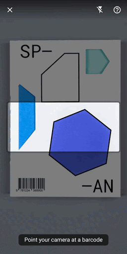

# Automatic Billing Machine

This app demonstrates how to build an end-to-end user experience between customer and Mall.

The goal of this app is to showcase an automatic billing machine. The following use cases are covered:
* Barcode detection - An end to end barcode scanning solution on the various products.

## Steps to run the app

* Clone this repo locally
* Build and run it on an Android device

## How to use the app

This app supports two usage scenarios: Live Camera and Static Barcode scan mode.

### Live Camera scenario

- Barcode detection
    - Barcode reticle width -- Size of barcode reticle width relative to the camera preview width
    - Barcode reticle height -- Size of the barcode reticle height relative to the camera preview height
    - Enable Barcode size check -- Will prompt user to "move closer" if the detected barcode is too small
    - Delay loading result -- Simulates a case where the detected barcode requires further processing before displaying the result.

### Static Image scenario

During this scenario, the app will prompt the user to select an image from the “Image Picker” (gallery), detect objects in the selected image, and then perform visual search on those objects. There are well designed UI components (overlay dots, card carousel etc.) to indicate the detected objects and search results.

